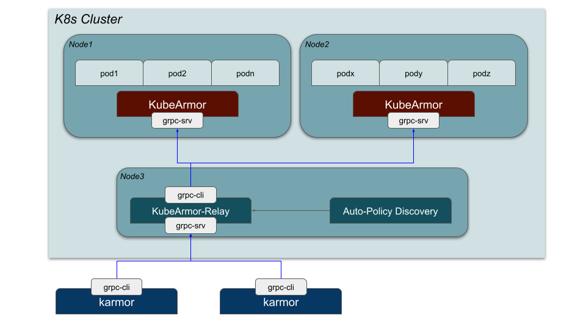
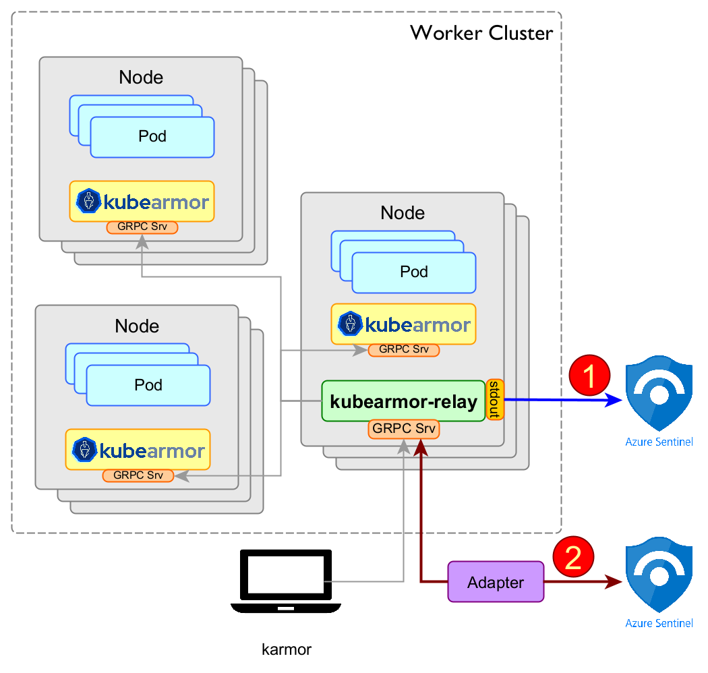

# KubeArmor Relay Server

KubeArmor's relay server collects all messages, alerts, and system logs generated by KubeArmor in each node, and then it allows other logging systems to simply collect those through the service ('kubearmor.kube-system.svc') of the relay server.

By default, the relay server is deployed with KubeArmor.



## Streaming Kubearmor Telemetry to external SIEM tools

KubeArmor emits following types of Telemetry events:
1. **Alert**: When policy is violated
2. **Log**: When a pod executes a syscall or any other action (such as file access, process creation, network socket create/connect/accept etc)
3. **Message**: Internal Kubearmor daemon messages

There are two approaches that one can take to stream the kubearmor events.
1. Using kubearmor-relay stdout: This is the easiest way i.e. if the SIEM tool connects to the k8s pod logging interface then all the kubearmor events (across all nodes) are available at the kubearmor-relay stdout. [Fluentd](https://docs.fluentd.org/v/0.12/articles/kubernetes-fluentd)/[Microsoft Sentinel](https://techcommunity.microsoft.com/t5/microsoft-sentinel-blog/monitoring-azure-kubernetes-service-aks-with-microsoft-sentinel/ba-p/1583204) does support this mode wherein the `stdout` of the pod can be streamed to the SIEM tool.
By default the stdout is turned off to not impact performance. To enable it update the environment variable in the deployment yaml `ENABLE_STDOUT_LOGS`, `ENABLE_STDOUT_ALERTS` , `ENABLE_STDOUT_MSGS` as `true `

example 
```
        env:
          - name: ENABLE_STDOUT_LOGS
            value: "true"
          - name: ENABLE_STDOUT_ALERTS
            value: "true"
          - name: ENABLE_STDOUT_MSGS
            value: "true"

```

2. Creating an adapter for the SIEM tool. Kubearmor-relay events could be accessed using its GRPC server ([ref code](https://github.com/kubearmor/kubearmor-client/tree/main/log)) and then the events could be streamed to the SIEM tool (splunk/elk/MS-sentinel ...). An example adaptor is [OpenTemetery-Adapater for KubeArmor](https://github.com/kubearmor/otel-adapter/), The OpenTelemetry KubeArmor receiver connects to KubeArmor-Relay and converts KubeArmor telemetry data to the OpenTelemetry format which in turn can be configured to connect to SIEM Tools like Splunk,Grafana etc. [Here's the tutorial](https://github.com/kubearmor/otel-adapter/blob/main/example/tutorials/tutorial.md) for the same.



> Microsoft Sentinel is used as an example in this figure
