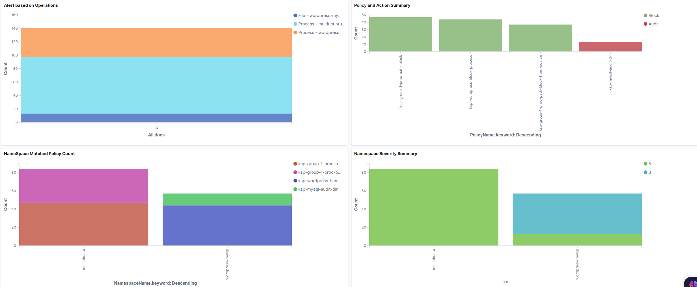
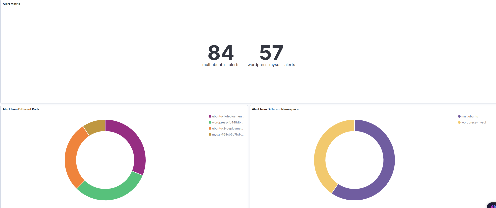

# kubearmor-elasticstack-logging


## Elastic Stack Visualisation(Elasticsearch and Kibana)


There would be 2 additional components along with the Relay server:

1. **Elasticsearch** is a real-time, distributed, and scalable search engine which allows for full-text and structured search, as well as analytics. Relay server logs can be indexed and searched through which would be produced in large volumes of log data.


2. **Kibana** is a data visualization frontend and dashboard for Elasticsearch. Kibana allows user to explore the log data in a visual manner that is stored in the Elasticsearch instance with the help of a web interface. Users would also be allowed to build dashboards or view existing ones which would help to answer and quickly gain insight about the pods managed by KubeArmor:

- Alert Metric
- Alert from Different Pods
- Alert from Different Namespace 
- Alert based on Operations
- Policy and Action Summary 
- NameSpace Matched Policy Count
- Namespace Severity Summary
- Alert Based on Tags

Kibana will be a part of deployment , while  ElasticSearch will be a part of StatefulSet that can run in any node

```
kubectl apply -f deployments/ek-dashboards
```

For the log data to be sent to elasticsearch, change the valus of ```enableEsDashboards``` in ```deployments/relay-deployment.yaml>spec>container>env``` to ```true``` , it should look like 

```
     .......

      containers:
      - name: kubearmor-relay-server
        image: sibashi/kubearmor-relay-server:latest
        env:
          - name: enableEsDashboards
            value: "true"
    .......

```

To View the DashBoards

1. Portforward the Kibana service
```
kubectl port-forward deployment/kibana -n kube-system 5601:5601
```
2. Open up a browser and go to [localhost:5601](localhost:5601)
3. Go to sidebar and open ``Mangement`` -> ``Saved Objects`` -> ``Import``

Drag and drop the file from ```docs/ek-dashboards/export.ndjson```

4. Go to ``Dashboard`` section , selct ``KA``

5. The visalisations should be ready 





